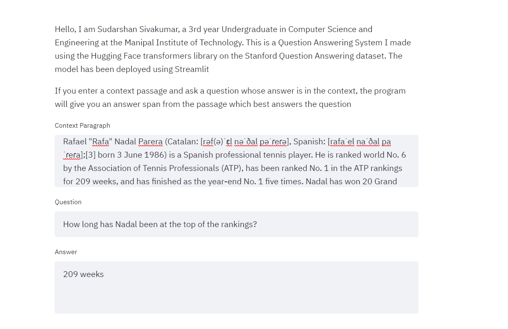

# SQuAD_QuestionAnswering
This is the code for a Question Answering System trained on the SQuAD dataset ( Version 1.1) using the HuggingFace Transformers Library. The final model obtained an exact match accuracy of 0.6  and F1 score of 0.74 on the validation set. Since this model was made using DistilBERT-base due to limitations in computational capacity, a model that uses BERT-base will definitely perform better. The code for this can be found in the DistilBERT_QA.ipynb file. The methodology for the project is as follows : 
  * The training question and context are tokenized using the distil-bert-cased tokenizer, and the answer start token and answer end token are calculated using the answer start character.  The question and context are separated using a <SEP> token and the maximum length of the entire sequence is 512 tokens.
  * After tokenizing the datasets and calculating start and end tokens, DataLoaders are created from the dataset using a batch size of 8.
  * The DistilBertForQuestionAnswering function is fine-tuned by feeding the batchwise input IDs,attention masks,and answer start and end positions. The training loss is 0.9, and the validation loss is 1.2 
  * The training and validation accuracy are computed using the fine-tuned model.  
 
 I also used Streamlit to deploy the system as an application, in which the user inputs a question and context, and is given the answer span from the context which is the most probable answer. The code for this can be found in the app.py file.  You can try out the app [here](https://share.streamlit.io/sudarshansivakumar/squad_questionanswering/main/app.py) . Attached below is a screenshot from the application
 
